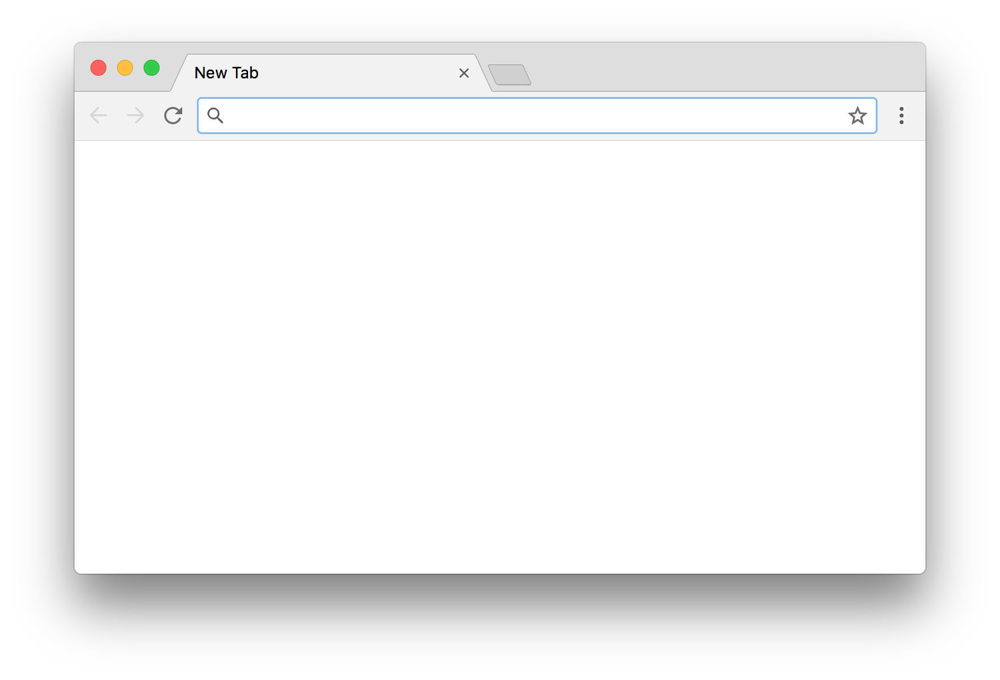

# Blank New Tab Page

A [Google Chrome](https://www.google.com/chrome/) extension that replaces the new tab page with a blank one.

## Installation

The extension can be added to Chrome via the [Chrome Web Store](https://chrome.google.com/webstore/detail/blank-new-tab-page/ggbepbemaaocmiffjfeppcccoohjfnob).

## Screenshot

## License

[ISC](LICENSE)
